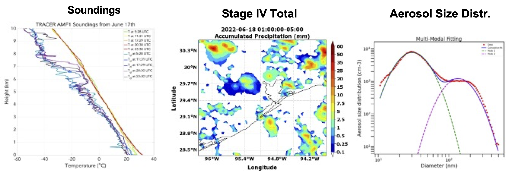

# Tracking Aerosol Convection Interaction Experiment (TRACER) Model Intercomparison Project (MIP) Roadmap
## 1. Introduction
The DOE ARM [Tracking Aerosol Convection Interaction Experiment (TRACER) campaign](https://www.arm.gov/research/campaigns/amf2021tracer) took place in the Houston, TX region from 01 October 2021 through 30 September 2022, with an IOP from June-September 2022, which collected a comprehensive data set focused on the evolution of convective clouds and their environment (including aerosol, cloud, thermodynamics, and lightning). A unique component of TRACER is that a large number of individual, isolated convective cells will be tracked and measured with high spatial and temporal resolution. These comprehensive, unique observational datasets can help evaluate model and parameterization performance, identify model and parameterization deficiencies, and gain new insights to improve models. This provides the motivation for conducting an additional community model intercomparison project (MIP) based on the previous Aerosol Cloud Precipitation Climate (ACPC) Deep Convective Cloud (DCC) MIP (ACPC-MIP; van den Heever et al. 2017; Marinescu et al. 2021; Saleeby et al. 2025; van den Heever et al. 2025), which is referred to as the TRACER-MIP.

## 2. Goals and Hypotheses of the TRACER-MIP
Goals:
i) Quantify the inter-model spread in representation of aerosol-convection interactions (ACI), identify model deficiencies, and measure model performance. .
ii) Examine factors/processes leading to the model biases and large model spread, both of which were less emphasized in the previous ACPC-MIP. This effort will ultimately help reduce the ACI uncertainty. 
Hypotheses:
i) The different representations of condensation and ice microphysics are a major source of  inter-model spread, thus, leading to the main model differences in the simulation of ACI.
ii) The models that reproduce the observed cases and employ explicit calculation of condensation give qualitatively consistent ACI effects, particularly for the effect of ultrafine particles.

## 3. Approach and Cases

The TRACER-MIP follows and builds upon the ACPC-MIP. The ACPC-MIP roadmap document can be found at this link.The TRACER-MIP has the following new features:

Extensive model evaluation against observations. 
Two golden cases with varying dynamic, thermodynamic, and aerosol conditions. Ultrafine aerosol will be considered. Two tiers: prescribed and prognostic aerosols.
More detailed focus on factors/processes leading to model biases and large model spread.
Two cases were chosen to simulate from among several “Golden” TRACER cases, which are June 17 and August 7, 2022 (Figures 1 and 2). Cases below were chosen since they met the following criteria:
Data available - SMPS aerosols (with ultrafine aerosols measured), soundings (5 per day), NEXRAD CAPPI, C-SAPR cell tracking
Seabreeze present, convection observed, and cells tracked
The June 17 case has widespread convection, featured with an afternoon sea breeze induced thunderstorm in the Houston area (Figure 1) with a high aerosol condition (~ 4000 cm-3; > 10 nm). This case has aircraft measurements from the co-current NSF ESCAPE field campaign. The August 7 case has a morning sea breeze front and a thunderstorm in the early afternoon in the Houston area with relatively cleaner aerosol conditions (~1700 cm-3; > 10 nm). 
A TRACER-MIP GitHub page has been established for sharing this roadmap document as well as other documentation and updates, analysis codes, model & parameterization descriptions, etc.
https://github.com/ARM-Synergy/tracer-mip

***Figure 1. The soundings (left), Stage IV precipitation (middle), and the pre-convective aerosol size distribution (right) measured at the TRACER main site by SMPS for the June 17 case.***
